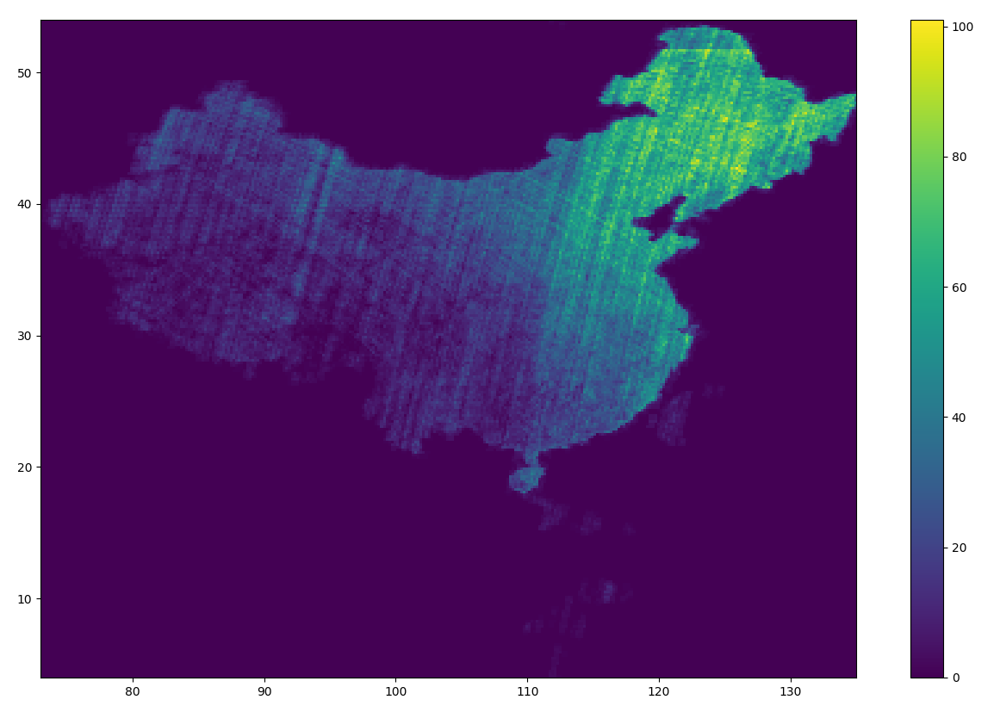

# Experiment Data Description
There are totally 1,211,874 scenes on rscloudmart whose capture date are in 01/05/2017 \~ 01/09/2017. 

Since rscloudmart only provide scenes in China. All the scenes are in the region whose longitude is in 73°E \~ 135°E and latitude is in 3°N \~ 53°N

For convenince, only 185,300 scenes from region whose longitude is in 120°E \~ 128°E and latitude is in 42°N \~ 50°N are selected. They are picked randomly to form experiment archieves of different size.

After we map the longtitude and latitude directly to the Eurlic space, we can calculate the area.

The area of the interested region is 8 * 8 = 64

The max area of 185,300 scenes is 0.446420, which is about 0.7% of the area of this region.

The min area of 185,300 scenes is 0.011082, which is about 0.017% of the area of this region.

The average area of 185,300 scenes is 0.024230, which is about 0.038% of the area of this region.
