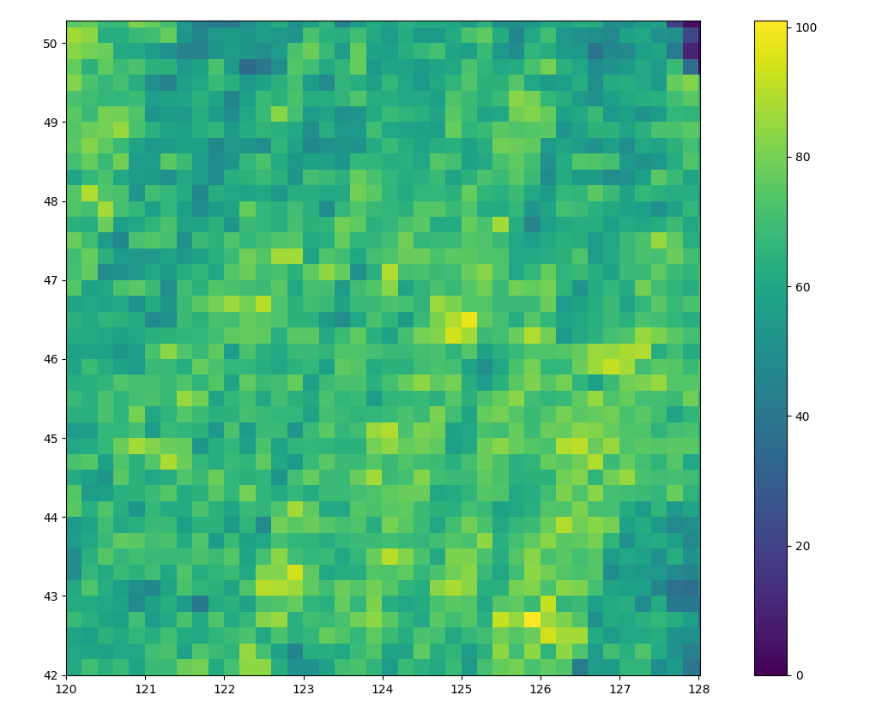

# Experiment Data Description

## Data Source

There are totally 1,211,874 scenes on rscloudmart whose capture date are in 01/05/2017 \~ 01/09/2017. 

Since rscloudmart only provide scenes in China. All the scenes are in the region whose longitude is in 73°E \~ 135°E and latitude is in 3°N \~ 53°N

## Archive

For convenience, only 185,300 scenes from region whose longitude is in 120°E \~ 128°E and latitude is in 42°N \~ 50°N are selected. They are picked randomly to form archives of different size.

After we map the longitude and latitude directly to the Euclidean space, we can calculate area.

The area of the archive region is 8 * 8 = 64

The min area of 185,300 scenes is 0.011082, which is about 0.017% of the area of this region.

The average area of 185,300 scenes is 0.024230, which is about 0.038% of the area of this region.

The median area of 185,300 scenes is 0.025322, which is about 0.040% of the area of this region.

The max area of 185,300 scenes is 0.446420, which is about 0.7% of the area of this region.

## Choose different δ

The illustration of cells of max, median, min scenes when different δ is selected.

### δ = 0.02 

#### min scene (0.017% of the whole archive area)

#### median scene (0.040% of the whole archive area)

#### max scene (0.7% of the whole archive area)

### δ = 0.01 (default)

#### min scene (0.017% of the whole archive area)

#### median scene (0.040% of the whole archive area)

#### max scene (0.7% of the whole archive area)

### δ = 0.005

#### min scene (0.017% of the whole archive area)

#### median scene (0.040% of the whole archive area) 

#### max scene (0.7% of the whole archive area)
