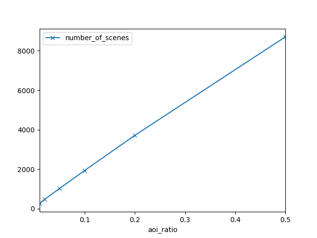
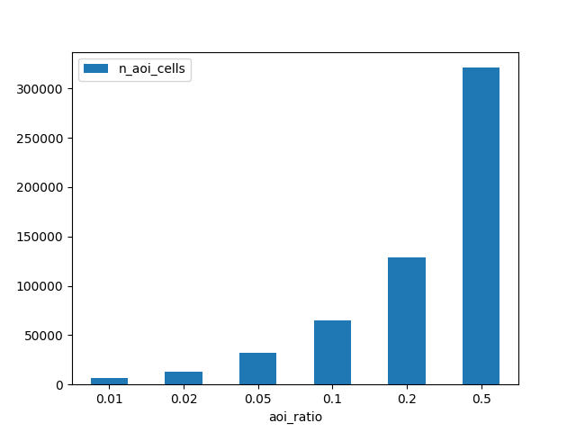
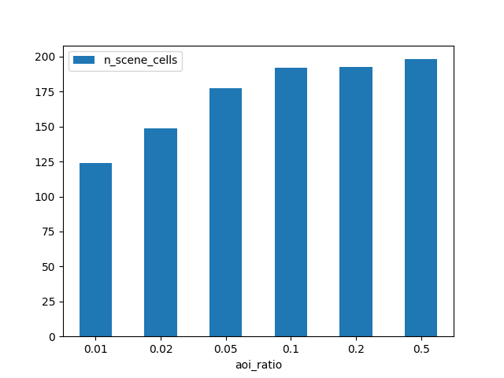
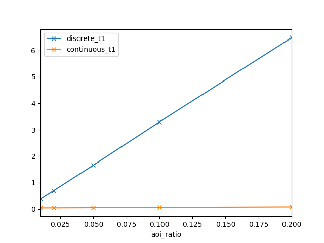
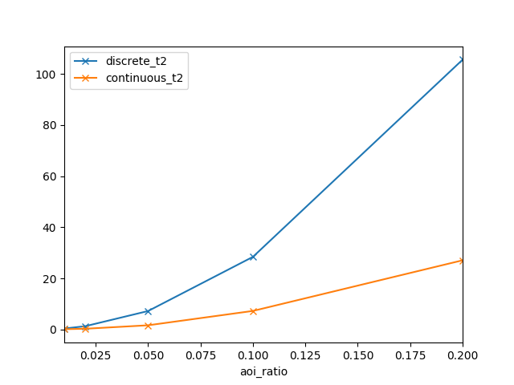

# Exp1 (5/10/2017)

## Notes
1. Still use boost::geometry. 
2. The first time use cell id to identify a cell.

## Results
> Note that the aoi size is the area of AOI while the archive area is the area of whole archive, which is 8 * 8 = 64.  0.39% * 64 = 0.25.

|Term | Value |
|:-|:-|
|aoi size|0.25 (0.39% archive area)|
|delta| 0.0005, 0.001, 0.002, 0.005, 0.01, 0.02|
|number of aoi|50|
|size of archive|15000|
|t - delta||

|Term | Value |
|:-|:-|
|aoi size|0.1 (0.16% archive area), 0.25 (0.39% archive area), 0.5 (0.78% archive area), 0.75 (1.17% archive area), 1.0 (1.56% archive area)|
|delta| 0.01 |
|number of aoi|50|
|size of archive| 15000|
|t - aoi size||

<!-- ## Comment -->

# Exp2 (12/10/2017)

## Notes
Based on Exp1:
1. give up boost::geometry. 
2. Change greedy method. Remove covered cells from cell sets after each greedy selection instead of calculating difference of the original cell sets every time.

## Results

|Term | Value |
|:-|:-|
|aoi size|0.25 (0.39% archive area)|
|delta| 0.0005, 0.001, 0.002, 0.005, 0.01, 0.02|
|number of aoi|50|
|size of archive|15000|
|t - delta||

|Term | Value |
|:-|:-|
|aoi size|0.1 (0.16% archive area), 0.25 (0.39% archive area), 0.5 (0.78% archive area), 0.75 (1.17% archive area), 1.0 (1.56% archive area)|
|delta| 0.01 |
|number of aoi|50|
|size of archive| 15000|
|t - aoi size||

## Comments

Giving up boost:geometry brings almost 5x faster t1 calculation. Removing covered cells from all rest cell id sets after each greedy selection also make t2 2x faster.

# Exp3 (14/10/2017)

## Notes
Based on Exp2: 
1. Change the scene discretization method by checking only the cells inside the intersection of AOI bounding-box and scenes.

## Results
|Term | Value |
|:-|:-|
|aoi size|0.25 (0.39% archive area)|
|delta| 0.0005, 0.001, 0.002, 0.005, 0.01, 0.02|
|number of aoi|50|
|size of archive|15000|
|t - delta||

|Term | Value |
|:-|:-|
|aoi size|0.1 (0.16% archive area), 0.25 (0.39% archive area), 0.5 (0.78% archive area), 0.75 (1.17% archive area), 1.0 (1.56% archive area)|
|delta| 0.01 |
|number of aoi|50|
|size of archive| 15000 |
|t - aoi size||

## Comments
Checking only the cells inside the intersection of AOI bounding-box and scenes makes t1 faster for most of the time. However, if AOI is large and scene is relatively small, t1 will takes more time to calculate the intersection and the performance will benefit little from the calculation of intersection.

Note that the calculation of intersection is based on the boost::geometry toolkit. While other polygon checking algorithms are implemented from scratch.

# Exp4 (16/10/2017)

## Notes
1. Change AOI to axis-aligned rectangle. 
2. Change the aoi-size variable to aoi-ratio, where aoi-ratio = the aoi-size / area of archive region.

## Results

> The aoi ratio here means the percentage of archive area. 0.01, 0.02, 0.05, 0.1, 0.2, 0.5 means respectively 1%, 2%, 5%, 10%, 20%, 50% of area of the whole archive. The corresponding size (previous used measurement) is 0.64, 1.28, 3.2, 6.4, 12.8, 32.

|Term |Value |
|:-|:-|
|aoi ratio| 1%, 2%, 5%, 10%, 20%, 50% |
|delta| 0.01 |
|number of aoi|50|
|size of archive| 15000 |
|t - aoi ratio||

## Comments
When the ratio is large, there are more possible scenes (noted by n), which costs O(n^2) time.

# Exp5 (22/10/2017)
## Notes
Previous t1 shows non-linear relationship with aoi-ratio, which is strange. In this experiment, the reason is found.

## Results

|Term |Value |
|:-|:-|
|aoi ratio| 1%, 2%, 5%, 10%, 20%, 50% |
|delta| 0.01 |
|number of aoi|50|
|size of archive| 15000 |
|number of scenes - aoi ratio||
|number of aoi cells - aoi ratio||
|average number of scene cells - aoi ratio||

## Comments
Number of scenes grow linearly as the ratio increases. t1 cost O(nmlogm) time, where n is the number of scenes, m is the average number of cell in a scene, which should also grows linearly. 

However, in Exp4, it didn't grow linearly. The reason is, in fact, the previous algorithm cost O(nmlogM) time, where M is the number of cell in the aoi. Even though m did not change with the aoi ratio too much, M changes rapidly. This leads to non-linearly increase of time.

# Exp5 (26/10/2017)
## Notes
1. Fix t1 algorithm, make it linearly increase with aoi-ratio
2. Add continuous solver, which shows better performance.

## Results

|Term |Value |
|:-|:-|
|aoi ratio| 1%, 2%, 5%, 10%, 20% |
|delta| 0.01 |
|number of aoi|25|
|size of archive| 15000 |
|t1 - aoi ratio||
|t2 - aoi ratio||
|price - aoi ratio||

## Comments
t1 - aoi ratio figure shows t1 of discrete algorithm linearly increases with aoi ratio now.

The results above shows the continuous solver is faster than the discrete solver, and gives lower price.