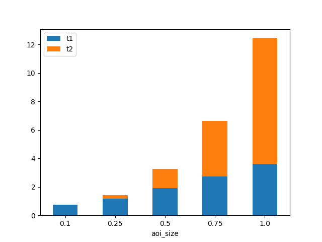
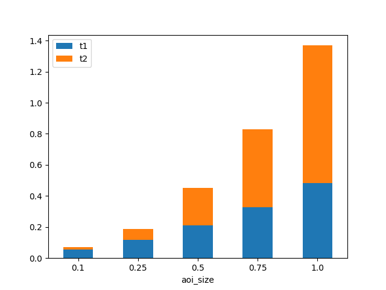
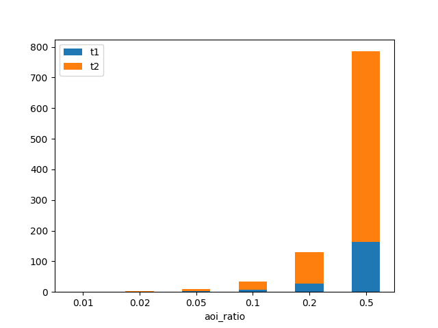

# Exp 1 (5/10/2017)
Still using boost::geometry. The first time use cell id to indentify a cell.

|Term | Value |
|:-|:-|
|aoi size|0.25 (0.39% archive area)|
|delta| 0.0005, 0.001, 0.002, 0.005, 0.01, 0.02|
|number of aoi|50|
|size of archive|15000|
|experiment result||

|Term | Value |
|:-|:-|
|aoi size|0.1 (0.16% archive area), 0.25 (0.39% archive area), 0.5 (0.78% archive area), 0.75 (1.17% archive area), 1.0 (1.56% archive area)|
|delta| 0.01 |
|number of aoi|50|
|size of archive| 15000|
|experiment result||

# Exp 2 (12/10/2017)
Based on Exp 1, give up boost::geometry. Change greedy method: update cell id sets by removing covered cells from them after each greedy selection instead of calculating difference of the original cell sets every time.

|Term | Value |
|:-|:-|
|aoi size|0.25 (0.39% archive area)|
|delta| 0.0005, 0.001, 0.002, 0.005, 0.01, 0.02|
|number of aoi|50|
|size of archive|15000|
|experiment result||

|Term | Value |
|:-|:-|
|aoi size|0.1 (0.16% archive area), 0.25 (0.39% archive area), 0.5 (0.78% archive area), 0.75 (1.17% archive area), 1.0 (1.56% archive area)|
|delta| 0.01 |
|number of aoi|50|
|size of archive| 15000|
|experiment result||

Giving up boost:geometry gives almost 5x faster in t1. Removing covered cells from all rest cell id sets after each greedy selection also make t2 process 2x faster.

# Exp 3 (14/10/2017)
Based on Exp 2, optimize the scene discretization method by checking only the cells inside the intersection of AOI bounding-box and scenes.

|Term | Value |
|:-|:-|
|aoi size|0.25 (0.39% archive area)|
|delta| 0.0005, 0.001, 0.002, 0.005, 0.01, 0.02|
|number of aoi|50|
|size of archive|15000|
|experiment result||

|Term | Value |
|:-|:-|
|aoi size|0.1 (0.16% archive area), 0.25 (0.39% archive area), 0.5 (0.78% archive area), 0.75 (1.17% archive area), 1.0 (1.56% archive area)|
|delta| 0.01 |
|number of aoi|50|
|size of archive| 15000 |
|experiment result||

Checking only the cells inside the intersection of AOI bounding-box and scenes makes t1 faster for most of the time. However, if AOI is large and scene is relatively small, t1 will takes more time to calculate the intersection and the performance will benefit little from the calculation of intersection.

Note that the calculation of intersection is based on the boost::geometry toolkit. While other polygon checking algorithms are implemented from scratch.

# Exp 4 (16/10/2017)
Change AOI to axis-aligned rectangle. Change the aoi-size variable to aoi-ratio, where aoi-ratio = the aoi-size / area of archive region.

|Term |Value |
|:-|:-|
|aoi ratio| 1%, 2%, 5%, 10%, 20%, 50% |
|delta| 0.01 |
|number of aoi|50|
|size of archive| 15000 |
|experiment result||

The aoi ratio here means the percentage of archive area (i.e. 8 * 8 = 64). 0.01, 0.02, 0.05, 0.1, 0.2, 0.5 means 1%, 2%, 5%, 10%, 20%, 50% archive area respectly. The corresponding size is 0.64, 1.28, 3.2, 6.4, 12.8, 32.

