# Exp1 (5/10/2017)

## Notes
1. Still use boost::geometry. 
2. The first time use cell id to identify a cell.

## Results
> Note that the roi size is the area of ROI while the archive area is the area of whole archive, which is 8 * 8 = 64.  0.39% * 64 = 0.25.

|Term | Value |
|:-|:-|
|roi size|0.25 (0.39% archive area)|
|delta| 0.0005, 0.001, 0.002, 0.005, 0.01, 0.02|
|number of roi|50|
|size of archive|15000|
|t - delta|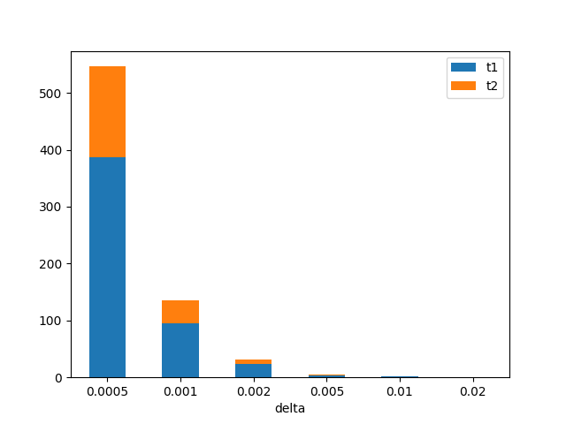|

|Term | Value |
|:-|:-|
|roi size|0.1 (0.16% archive area), 0.25 (0.39% archive area), 0.5 (0.78% archive area), 0.75 (1.17% archive area), 1.0 (1.56% archive area)|
|delta| 0.01 |
|number of roi|50|
|size of archive| 15000|
|t - roi size||

<!-- ## Comment -->

# Exp2 (12/10/2017)

## Notes
Based on Exp1:
1. give up boost::geometry. 
2. Change greedy method. Remove covered cells from cell sets after each greedy selection instead of calculating difference of the original cell sets every time.

## Results

|Term | Value |
|:-|:-|
|roi size|0.25 (0.39% archive area)|
|delta| 0.0005, 0.001, 0.002, 0.005, 0.01, 0.02|
|number of roi|50|
|size of archive|15000|
|t - delta|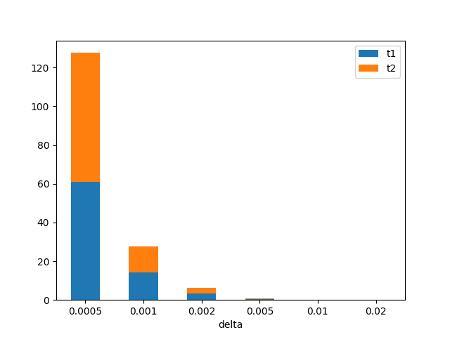|

|Term | Value |
|:-|:-|
|roi size|0.1 (0.16% archive area), 0.25 (0.39% archive area), 0.5 (0.78% archive area), 0.75 (1.17% archive area), 1.0 (1.56% archive area)|
|delta| 0.01 |
|number of roi|50|
|size of archive| 15000|
|t - roi size|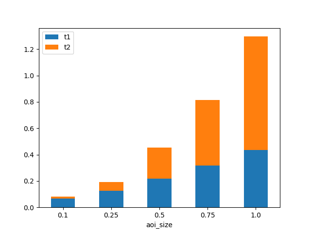|

## Comments

Giving up boost:geometry brings almost 5x faster t1 calculation. Removing covered cells from all rest cell id sets after each greedy selection also make t2 2x faster.

# Exp3 (14/10/2017)

## Notes
Based on Exp2: 
1. Change the scene discretization method by checking only the cells inside the intersection of ROI bounding-box and scenes.

## Results
|Term | Value |
|:-|:-|
|roi size|0.25 (0.39% archive area)|
|delta| 0.0005, 0.001, 0.002, 0.005, 0.01, 0.02|
|number of roi|50|
|size of archive|15000|
|t - delta|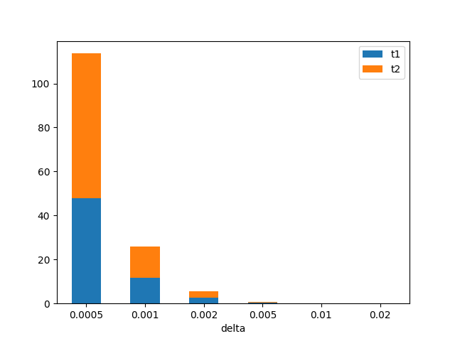|

|Term | Value |
|:-|:-|
|roi size|0.1 (0.16% archive area), 0.25 (0.39% archive area), 0.5 (0.78% archive area), 0.75 (1.17% archive area), 1.0 (1.56% archive area)|
|delta| 0.01 |
|number of roi|50|
|size of archive| 15000 |
|t - roi size|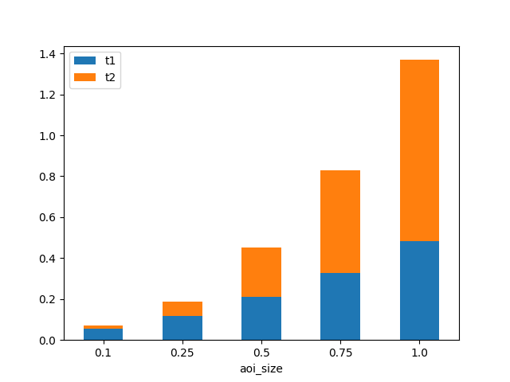|

## Comments
Checking only the cells inside the intersection of ROI bounding-box and scenes makes t1 faster for most of the time. However, if ROI is large and scene is relatively small, t1 will takes more time to calculate the intersection and the performance will benefit little from the calculation of intersection.

Note that the calculation of intersection is based on the boost::geometry toolkit. While other polygon checking algorithms are implemented from scratch.

# Exp4 (16/10/2017)

## Notes
1. Change ROI to axis-aligned rectangle. 
2. Change the roi-size variable to roi-ratio, where roi-ratio = the roi-size / area of archive region.

## Results

> The roi ratio here means the percentage of archive area. 0.01, 0.02, 0.05, 0.1, 0.2, 0.5 means respectively 1%, 2%, 5%, 10%, 20%, 50% of area of the whole archive. The corresponding size (previous used measurement) is 0.64, 1.28, 3.2, 6.4, 12.8, 32.

|Term |Value |
|:-|:-|
|roi ratio| 1%, 2%, 5%, 10%, 20%, 50% |
|delta| 0.01 |
|number of roi|50|
|size of archive| 15000 |
|t - roi ratio|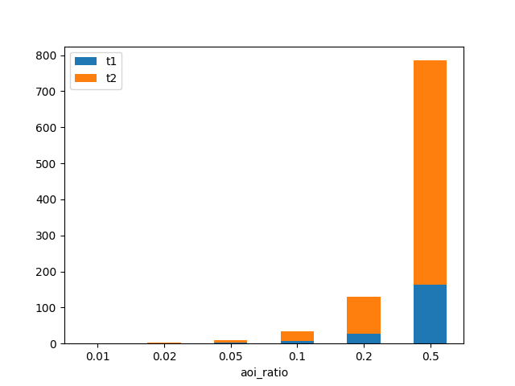|

## Comments
When the ratio is large, there are more possible scenes (noted by n), which costs O(n^2) time.

# Exp5 (22/10/2017)
## Notes
Previous t1 shows non-linear relationship with roi-ratio, which is strange. In this experiment, the reason is found.

## Results

|Term |Value |
|:-|:-|
|roi ratio| 1%, 2%, 5%, 10%, 20%, 50% |
|delta| 0.01 |
|number of roi|50|
|size of archive| 15000 |
|number of scenes - roi ratio|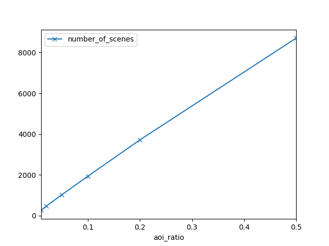|
|number of roi cells - roi ratio||
|average number of scene cells - roi ratio|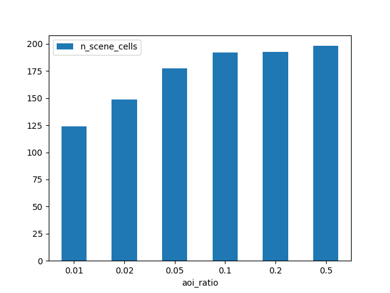|

## Comments
Number of scenes grow linearly as the ratio increases. t1 cost O(nmlogm) time, where n is the number of scenes, m is the average number of cell in a scene, which should also grows linearly. 

However, in Exp4, it didn't grow linearly. The reason is, in fact, the previous algorithm cost O(nmlogM) time, where M is the number of cell in the roi. Even though m did not change with the roi ratio too much, M changes rapidly. This leads to non-linearly increase of time.

# Exp6 (26/10/2017)
## Notes
1. Fix t1 algorithm, make it linearly increase with roi-ratio
2. Add continuous solver, which shows better performance.

## Results

|Term |Value |
|:-|:-|
|roi ratio| 1%, 2%, 5%, 10%, 20% |
|delta| 0.01 |
|number of roi|25|
|size of archive| 15000 |
|t1 - roi ratio|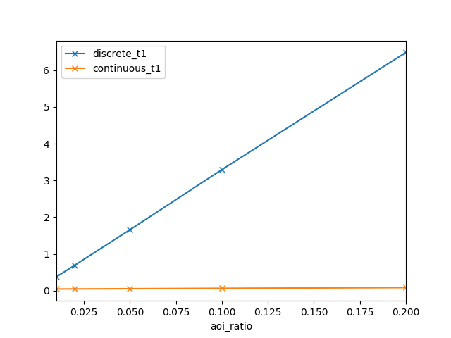|
|t2 - roi ratio|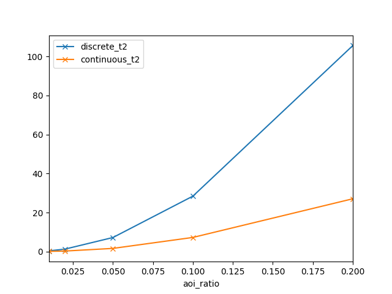|
|price - roi ratio||

## Comments
t1 - roi ratio figure shows t1 of discrete algorithm linearly increases with roi ratio now.

The results above shows the continuous solver is faster than the discrete solver, and gives lower price.

# Exp7 (30/10/2017)
## Notes
1. Modify intersection of cell set, use set_intersection, which make discrete t2 faster

## Results
|Term |Value |
|:-|:-|
|roi ratio| 1%, 2%, 5%, 10%, 20% |
|delta| 0.01 |
|number of roi|25|
|size of archive| 15000 |
|t2 - roi ratio|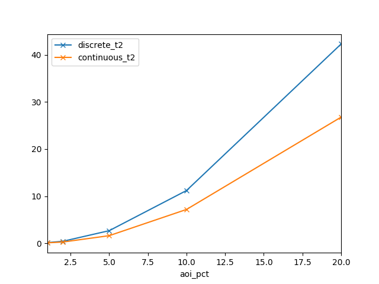|

## Comments
This improve discrete t2 about 2x faster

# Exp8 (30/10/2017)
## Notes
1. check whether the origin polygon intersects before calculate the difference

## Results
|Term |Value |
|:-|:-|
|roi ratio| 1%, 2%, 5%, 10%, 20% |
|delta| 0.01 |
|number of roi|25|
|size of archive| 15000 |
|t2 - roi ratio|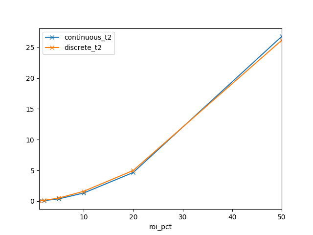|

## Comments
This make discrete t2 about 10x faster and continuous t2 about 5x faster.

# Exp9 (31/10/2017)
## Notes
1. an overall run based on Exp8

## Results

|Term |Value |
|:-|:-|
|roi ratio| 5%|
|delta| 0.005, 0.01, 0.015, 0.02, 0.025|
|number of roi|25|
|size of archive| 15000 |
|t1 - delta|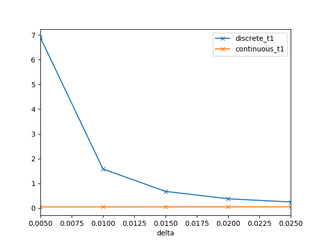|
|t2 - delta|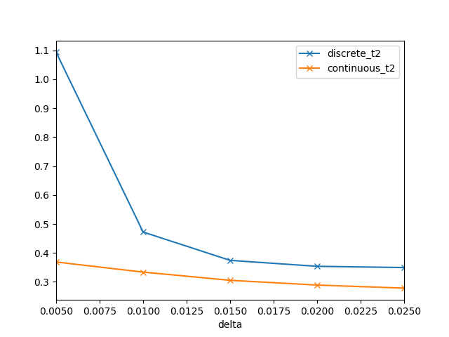|
|price - delta|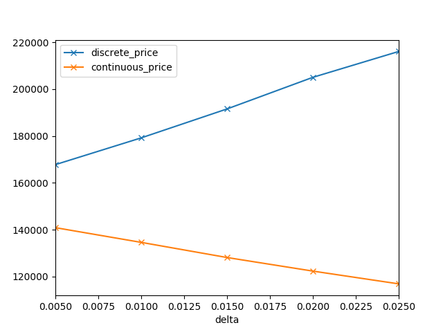|

---

|Term |Value |
|:-|:-|
|roi ratio| 1%, 2%, 5%, 10%, 20% |
|delta| 0.01 |
|number of roi|25|
|size of archive| 15000 |
|t1 - roi pct|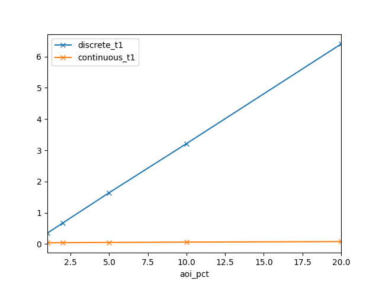|
|t2 - roi pct|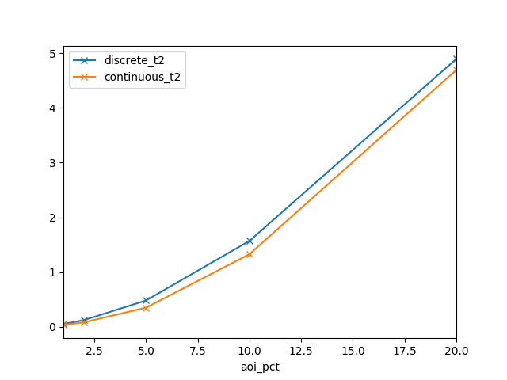|
|price - roi pct|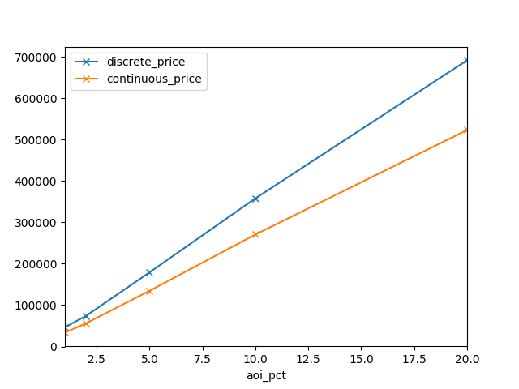|

---

|Term |Value |
|:-|:-|
|roi ratio| 5%|
|delta| 0.01 |
|number of roi|25|
|size of archive| 10000, 15000, 20000, 50000, 75000, 100000 |
|t1 - archive|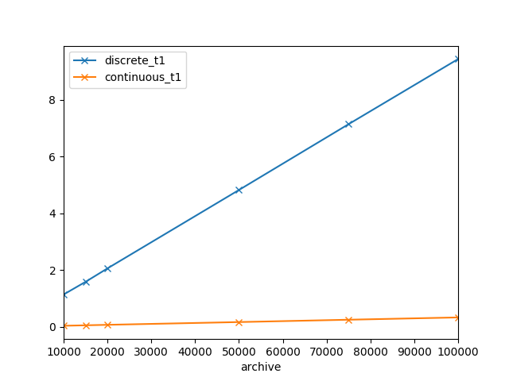|
|t2 - archive|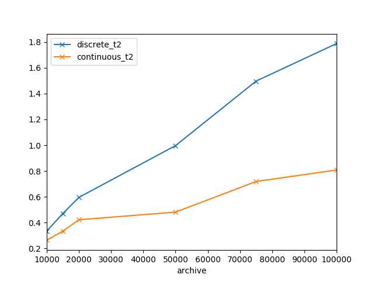|
|price - archive|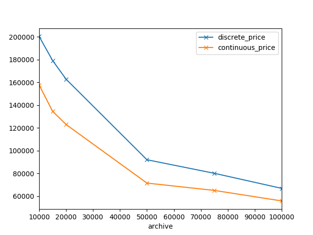|

# Exp10 (3/11/2017)
## Notes
1. add iteration monitor

## Results

|Term |Value |
|:-|:-|
|roi ratio| 20%|
|delta| 0.01|
|number of roi|1|
|size of archive| 15000 |
|price - coverage ratio|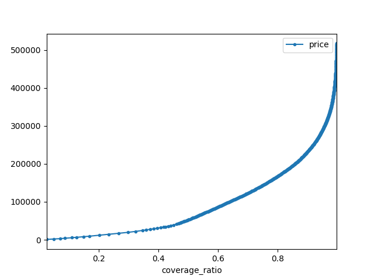|
|time - coverage ratio|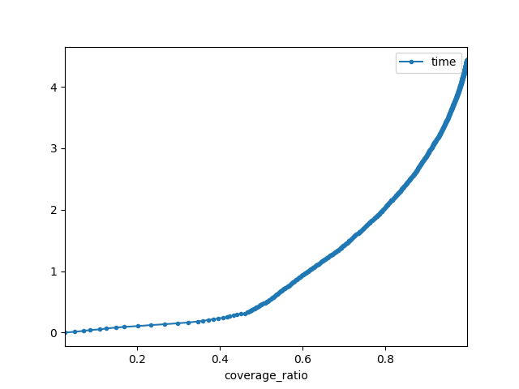|

# Exp10 (8/11/2017)
## Notes
1. add branch and bound method

## Results
|Term |Value |
|:-|:-|
|roi ratio| 0.02%, 0.04%, 0.06%, 0.08%, 0.1%, 0.12%|
|delta| 0.01|
|number of roi|0.9|
|target coverage ratio| 0.9|
|number of roi|20|
|size of archive| 15000 |
|price - roi percentage|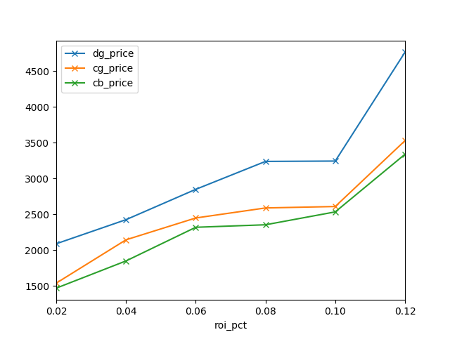|
|number of scenes- roi percentage|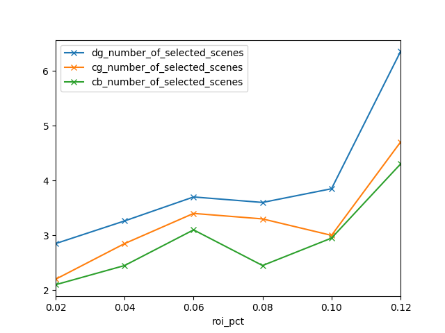|
|t2 - roi percentage|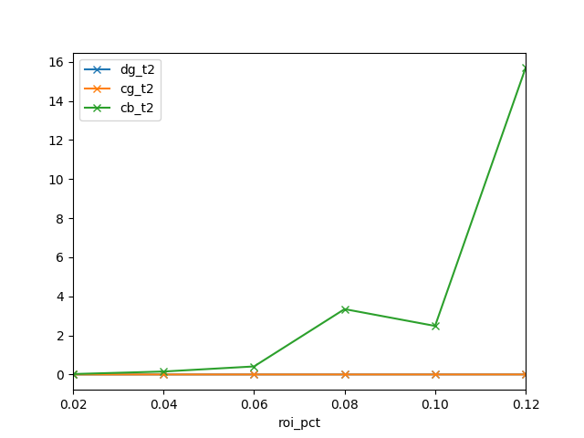|

# Exp11 (8/11/2017)
## Notes
1. add branch and bound method

## Results
|Term |Value |
|:-|:-|
|roi ratio| 0.02%, 0.04%, 0.06%, 0.08%, 0.1%, 0.12%|
|delta| 0.01|
|number of roi|0.9|
|target coverage ratio| 0.9|
|number of roi|20|
|size of archive| 15000 |
|price - roi percentage|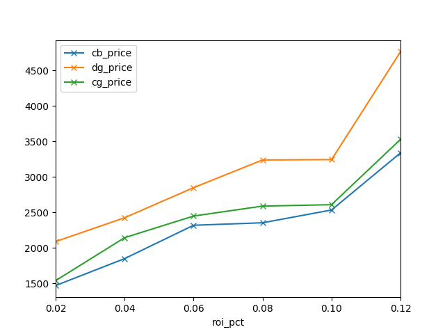|
|number of scenes- roi percentage|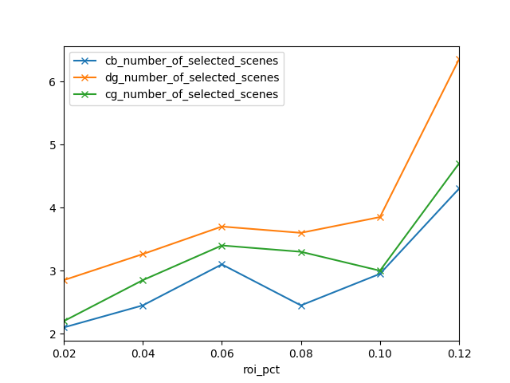|
|t2 - roi percentage|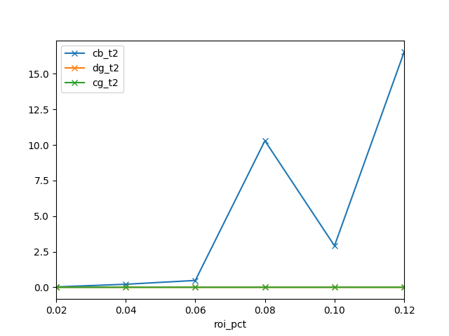|